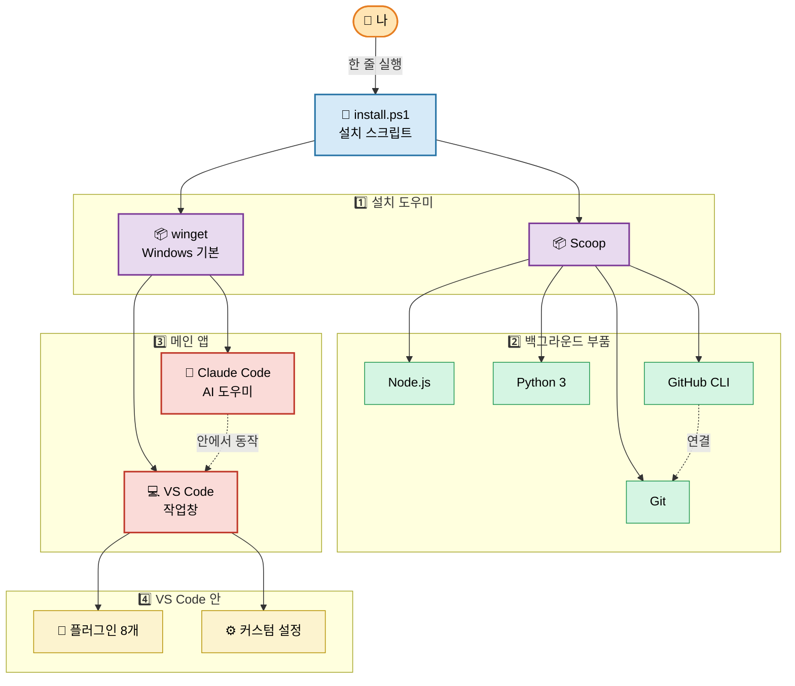
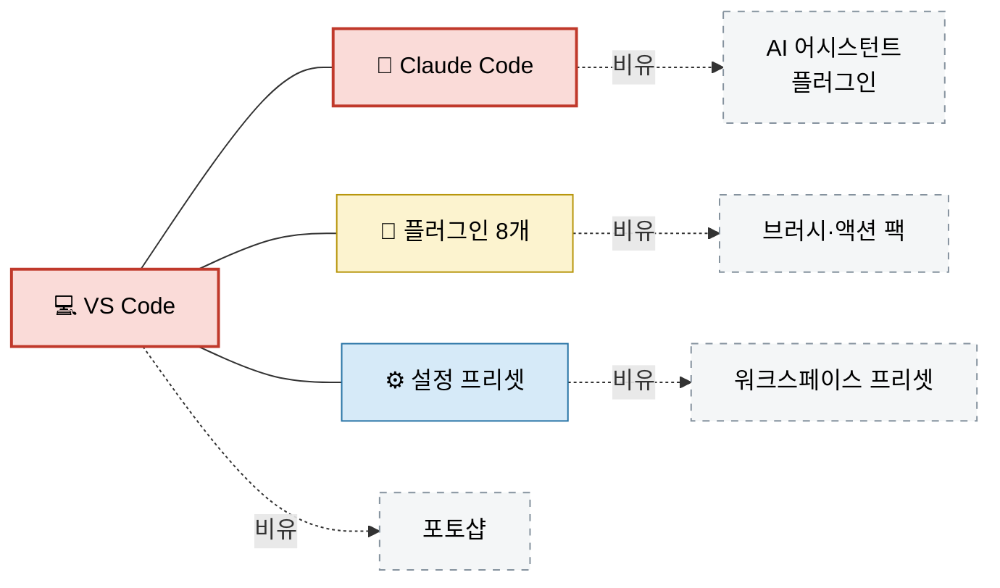
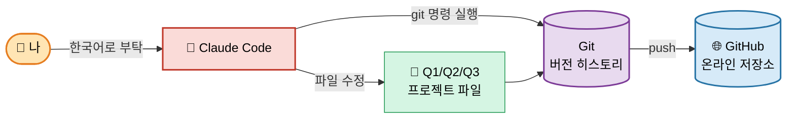

# 설치 구조도

> `irm ... | iex` 한 줄을 실행했을 때 컴퓨터에서 일어난 일

## 전체 흐름

```mermaid
flowchart TD
    User([👤 나]):::user
    Script[📜 install.ps1<br/>설치 스크립트]:::script

    User -->|한 줄 실행| Script

    subgraph S1 [" 1️⃣ 설치 도우미 "]
        Scoop[📦 Scoop]:::mgr
        Winget[📦 winget<br/>Windows 기본]:::mgr
    end

    subgraph S2 [" 2️⃣ 백그라운드 부품 "]
        Node[Node.js]:::tool
        Python[Python 3]:::tool
        Git[Git]:::tool
        GH[GitHub CLI]:::tool
    end

    subgraph S3 [" 3️⃣ 메인 앱 "]
        VSCode[💻 VS Code<br/>작업창]:::app
        Claude[🤖 Claude Code<br/>AI 도우미]:::app
    end

    subgraph S4 [" 4️⃣ VS Code 안 "]
        Plugins[🧩 플러그인 8개]:::extra
        Settings[⚙️ 커스텀 설정]:::extra
    end

    Script --> Scoop
    Script --> Winget

    Scoop --> Node
    Scoop --> Python
    Scoop --> Git
    Scoop --> GH

    Winget --> VSCode
    Winget --> Claude

    VSCode --> Plugins
    VSCode --> Settings

    Claude -.안에서 동작.-> VSCode
    GH -.연결.-> Git

    classDef user fill:#FFE5B4,stroke:#E67E22,stroke-width:2px,color:#000
    classDef script fill:#D6EAF8,stroke:#2874A6,stroke-width:2px,color:#000
    classDef mgr fill:#E8DAEF,stroke:#7D3C98,stroke-width:2px,color:#000
    classDef tool fill:#D5F5E3,stroke:#229954,stroke-width:1px,color:#000
    classDef app fill:#FADBD8,stroke:#C0392B,stroke-width:2px,color:#000
    classDef extra fill:#FCF3CF,stroke:#B7950B,stroke-width:1px,color:#000
```

---

## 디자이너용 비유

```mermaid
flowchart LR
    A[💻 VS Code]:::main
    B[🤖 Claude Code]:::main
    C[🧩 플러그인 8개]:::plugin
    D[⚙️ 설정 프리셋]:::preset

    A --- B
    A --- C
    A --- D

    A -.비유.-> A2[포토샵]:::analogy
    B -.비유.-> B2[AI 어시스턴트<br/>플러그인]:::analogy
    C -.비유.-> C2[브러시·액션 팩]:::analogy
    D -.비유.-> D2[워크스페이스 프리셋]:::analogy

    classDef main fill:#FADBD8,stroke:#C0392B,stroke-width:2px,color:#000
    classDef plugin fill:#FCF3CF,stroke:#B7950B,stroke-width:1px,color:#000
    classDef preset fill:#D6EAF8,stroke:#2874A6,stroke-width:1px,color:#000
    classDef analogy fill:#F4F6F7,stroke:#85929E,stroke-width:1px,stroke-dasharray: 5 5,color:#000
```

---

## 지금 우리가 하는 작업과의 관계

```mermaid
flowchart LR
    Me([👤 나]):::user
    Claude[🤖 Claude Code]:::app
    Files[📁 Q1/Q2/Q3<br/>프로젝트 파일]:::file
    Git[(Git<br/>버전 히스토리)]:::git
    GH[(🌐 GitHub<br/>온라인 저장소)]:::gh

    Me -->|"한국어로 부탁"| Claude
    Claude -->|"파일 수정"| Files
    Claude -->|"git 명령 실행"| Git
    Files --> Git
    Git -->|"push"| GH

    classDef user fill:#FFE5B4,stroke:#E67E22,stroke-width:2px,color:#000
    classDef app fill:#FADBD8,stroke:#C0392B,stroke-width:2px,color:#000
    classDef file fill:#D5F5E3,stroke:#229954,stroke-width:1px,color:#000
    classDef git fill:#E8DAEF,stroke:#7D3C98,stroke-width:2px,color:#000
    classDef gh fill:#D6EAF8,stroke:#2874A6,stroke-width:2px,color:#000
```
