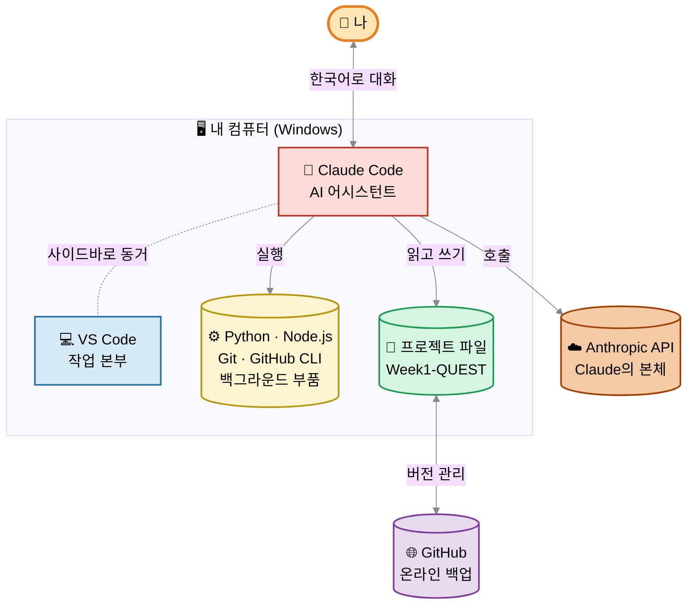
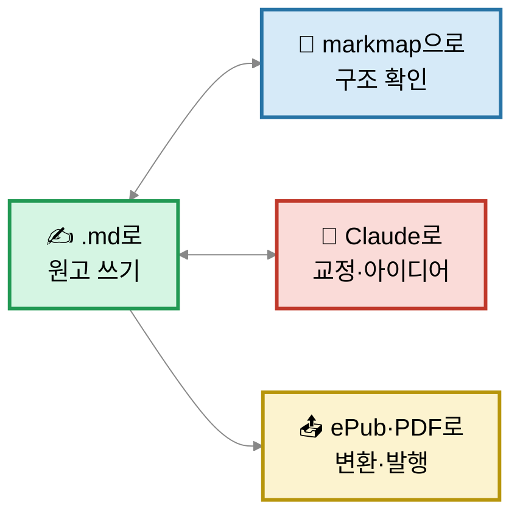
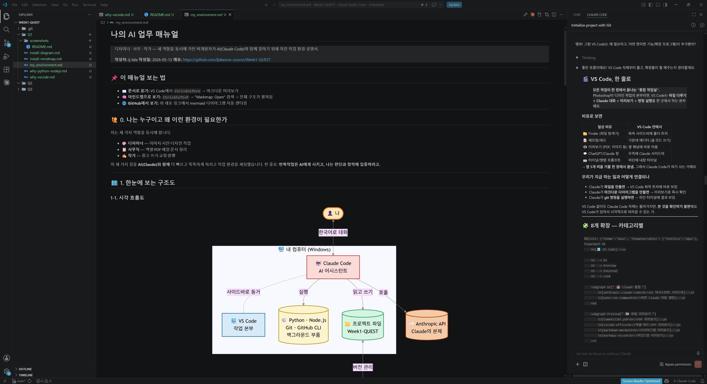

# 나의 AI 업무 매뉴얼

> 디자이너 · 사무 · 작가 — 세 역할을 동시에 가진 비개발자가 AI(Claude Code)와 함께 일하기 위해 차린 작업 환경 설명서.
>
> **작성자:** lj-lala
> **작성일:** 2026-05-13
> **레포:** https://github.com/ljlalanow-source/Week1-QUEST

---

## 📌 이 매뉴얼 보는 법

- **📖 문서로 읽기:** VS Code에서 `Ctrl+Shift+V` → 마크다운 미리보기
- **🧠 마인드맵으로 보기:** `Ctrl+Shift+P` → "Markmap: Open" 검색 → 전체 구조가 펼쳐짐
- **🌐 GitHub에서 보기:** 위 레포 링크에서 mermaid 다이어그램 자동 렌더링

---

## 🙋 0. 나는 누구이고 왜 이런 환경이 필요한가

저는 세 가지 역할을 동시에 합니다:

- 🎨 **디자이너** — 이미지·시안·디자인 작업
- 📋 **사무직** — 엑셀·PDF·메일·문서 정리
- ✍️ **작가** — 원고 쓰기·교정·발행

이 세 가지 일을 **AI(Claude)와 함께** 더 빠르고 똑똑하게 하려고 작업 환경을 세팅했습니다. 한 줄로: **반복작업은 AI에게 시키고, 나는 판단과 창작에 집중하려고.**

---

## 🗺️ 1. 한눈에 보는 구조도

### 1-1. 시각 흐름도

### 1-2. 마인드맵 구조 (Markmap용)

> 이 파일 전체를 **Markmap**으로 열면 매뉴얼의 모든 섹션이 마인드맵으로 펼쳐집니다.
> 아래는 "내 컴퓨터 + AI 연결" 구조만 따로 요약한 것:

- **🖥️ 내 컴퓨터 (Windows)**
  - 📦 패키지 매니저 (설치 도우미)
    - Scoop
    - winget (Windows 기본)
  - ⚙️ 백그라운드 부품
    - Node.js (JS 엔진)
    - Python (Py 엔진)
    - Git (버전 관리)
    - GitHub CLI (GitHub 연결)
  - 💻 메인 앱
    - VS Code (작업 본부)
      - 8개 확장
        - 🤖 Claude 통합 (2)
        - 👀 미리보기 (4)
        - 🌐 외부 연결 (1)
        - 🎨 외관 (1)
    - Claude Code (AI 어시스턴트)
- **🌐 GitHub 클라우드**
  - ljlalanow-source/Week1-QUEST 레포
    - main 브랜치
    - 커밋 히스토리
- **🤖 Claude (AI)**
  - VS Code 사이드바에서 대화
  - 파일 직접 수정 가능
  - 명령(git, 설치 등) 실행 가능
  - Anthropic의 클라우드 AI 모델

---

## 🔧 2. 업무 자동화 도구 설명서

### 2-1. 메인 앱 (내가 직접 쓰는 것)

#### 💻 VS Code

- **한 마디로:** 모든 작업이 한 창에서 끝나는 통합 작업실
- **포토샵 비유:** 디자인 작업의 본부가 Photoshop이라면, VS Code는 글·문서·자동화의 본부
- **무엇이 들어있나:** 파일 탐색기 + 에디터 + 미리보기 + Claude 사이드바 + 터미널 (한 창)
- **세 역할에서 쓰임:**
  - 🎨 디자이너: 웹 시안 HTML 미리보기, 컬러 폴더 정리, 구조도 시각화
  - 📋 사무: 받은 PDF·엑셀 그 자리에서 보기, 회의록 정리
  - ✍️ 작가: 마크다운으로 원고 쓰기 + markmap으로 구조 확인

#### 🤖 Claude Code

- **한 마디로:** VS Code 안에 사는 AI 어시스턴트
- **포토샵 비유:** 포토샵 안에서 도와주는 AI 플러그인
- **무엇을 할 수 있나:**
  - 파일을 만들고 수정 (이 매뉴얼도 Claude가 작성)
  - 명령(git, 설치 등) 실행
  - 글을 쓰고 정리
  - 다이어그램·마인드맵 생성
  - 자동화 스크립트 작성·실행

### 2-2. 백그라운드 부품 (자동으로 돌아가는 것)

#### 🐍 Python

- **한 마디로:** Python 언어로 쓴 자동화 도구를 돌리는 **엔진(런타임)**
- **요리 비유:** Python 레시피를 읽고 요리해주는 "요리사"
- **용어 정리:** 런타임 · 엔진 · 인터프리터 모두 같은 말
- **왜 깔려있나:** 디자이너·사무·작가 자동화의 70%가 Python 기반
  - 이미지 일괄 처리, AI 이미지 생성(Stable Diffusion)
  - 엑셀 자동 리포트, PDF 합치기·쪼개기
  - AI 글쓰기 도구, 원고 포맷 변환

#### 🟢 Node.js

- **한 마디로:** JavaScript 언어로 쓴 도구를 돌리는 **엔진(런타임)**
- **요리 비유:** JS 레시피를 읽고 요리해주는 "또 다른 요리사"
- **용어 정리:** Python과 똑같이 엔진/런타임/인터프리터 다 같은 말
- **왜 깔려있나:**
  - **Claude Code 자체가 Node.js 위에서 돌아감** (필수)
  - Figma 플러그인, 메일·슬랙 자동 발송, 블로그 자동 발행

> 💡 더 자세히 → [why-python-nodejs.md](why-python-nodejs.md)

#### 📚 Git

- **한 마디로:** 작업물의 "버전 히스토리"
- **디자이너 비유:** `시안_v1.psd`, `시안_최종.psd`, `시안_진짜최종.psd` 안 만들고도 모든 변경이 자동 기록되는 시스템
- **왜 필요한가:** AI가 만진 파일을 안전하게 추적·복원. 실수해도 이전 상태로 되돌릴 수 있음.

#### 🐙 GitHub CLI (gh)

- **한 마디로:** 터미널에서 GitHub를 다루는 도구
- **비유:** Adobe Creative Cloud 데스크탑 앱 같은 거 — 클라우드 동기화를 명령으로 제어
- **언제 쓰는가:** repo 만들기, PR 보내기, 이슈 확인 등

#### 📦 Scoop

- **한 마디로:** Windows용 앱 자동 설치 도우미
- **비유:** 폰트 매니저나 어도비 익스체인지 같은 것 — "이거 깔아줘" 하면 알아서 설치
- **누가 깔았나:** 설치 스크립트가 첫 단계에서 깔았음. 그 다음 Scoop이 Node·Python·Git·gh를 깔았음.

### 2-3. VS Code 확장 8개

| 카테고리 | 확장 | 무엇 | 특히 도움되는 역할 |
|---------|------|------|------------------|
| 🤖 AI 통합 | `anthropic.claude-code` | Claude 사이드바 | 세 역할 모두 |
| 🤖 AI 통합 | `auto-run-command` | VS Code 켜면 Claude 자동 열림 | 세 역할 모두 |
| 👀 미리보기 | `tomoki1207.pdf` | PDF 미리보기 | 📋 사무 · ✍️ 작가 |
| 👀 미리보기 | `cweijan.vscode-office` | 엑셀/워드/PPT 미리보기 | 📋 사무 |
| 👀 미리보기 | `bierner.markdown-mermaid` | 다이어그램 미리보기 | 세 역할 모두 |
| 👀 미리보기 | `gera2ld.markmap-vscode` | 마인드맵 미리보기 | ✍️ 작가 · 📋 사무 |
| 🌐 외부 연결 | `peakchen90.open-html-in-browser` | HTML 브라우저로 바로 열기 | 🎨 디자이너 |
| 🎨 외관 | `pkief.material-icon-theme` | 컬러 아이콘 테마 | 🎨 디자이너 |

> 💡 더 자세히 → [why-vscode.md](why-vscode.md)

---

## 📖 3. 핵심 용어 사전

업무 맥락에서 정의한 용어들. 가나다순.

| 용어 | 한 줄 정의 | 디자이너/사무/작가 맥락에서 |
|------|----------|---------------------------|
| **CLI** | Command Line Interface — 터미널에 명령어를 타이핑하는 방식 | 영어 문장이 아니라 정해진 **"키워드 단축키"** 조합(예: `git push`, `npm install`). 마우스 클릭의 글자 버전. 거의 다 Claude가 알아서 실행해줌. |
| **Commit (커밋)** | "버전 저장점"을 찍는 행위 | 작업물에 *"여기까지가 v1"* 도장 찍는 것. 메시지와 함께 기록됨. |
| **Extension (확장)** | VS Code에 붙이는 플러그인 | 포토샵 플러그인 / Adobe Exchange의 액션 팩과 비슷. |
| **Git** | 버전 관리 시스템 | `_v1`, `_최종` 폴더 안 만들고도 모든 변경이 자동 기록. 되돌리기·비교 가능. |
| **GitHub** | 온라인 코드/파일 저장소 | 디자인 파일을 드롭박스에 백업하는 것의 코드 버전. |
| **IDE** | Integrated Development Environment | 통합 작업실 = VS Code 같은 거. |
| **Markdown (.md)** | 평문 + 형식 지시가 섞인 글쓰기 포맷 | 워드/한글의 가볍고 만국 공통판. AI가 가장 좋아하는 포맷. |
| **Markmap** | .md 파일을 마인드맵으로 보여주는 도구 | 글 구조 · 회의 요약 · 프로젝트 컨셉 시각화에 최적. |
| **Mermaid** | .md 안에 다이어그램을 글로 적는 문법 | 글로 적은 명령이 → 미리보기에서 그림으로 자동 변환. |
| **Node.js** | JavaScript 언어 실행 엔진 (= 런타임) | JS로 쓴 도구를 컴퓨터에서 돌리게 해주는 엔진. Claude Code의 기반. |
| **npm** | Node.js의 패키지 매니저 | JS용 앱스토어. `npm install <도구이름>` 으로 도구 설치. |
| **Pull** | 원격 → 내 컴퓨터로 가져오기 | 드롭박스에서 최신 파일 받아오기와 비슷. |
| **Push** | 내 컴퓨터 → 원격으로 보내기 | 드롭박스에 작업한 파일 업로드와 비슷. |
| **Python** | 프로그래밍 언어 + 실행 엔진 (= 런타임) | 자동화 도구의 절반 이상이 이 언어로 작성됨. 같은 이름이 언어/엔진 둘 다 가리킴. |
| **Repository (Repo)** | 프로젝트 보관소 | 프로젝트 폴더 + 변경 이력 + 협업 기능이 한 묶음. |
| **Runtime (런타임) = 엔진 = 인터프리터** | 코드를 읽고 실제로 실행하는 프로그램 | **세 단어 모두 같은 말.** 레시피(코드) ↔ 요리사(엔진) 비유의 "요리사". Python·Node.js가 대표적인 엔진. |
| **Scoop** | Windows용 패키지 매니저 | "이 도구들 깔아줘" 자동 설치 도우미. |
| **Terminal (터미널)** | CLI 명령어를 타이핑하는 검은 창 | VS Code 하단에 내장 (`` Ctrl + ` ``로 열기). Claude가 작업할 때 이 창에 명령이 자동 실행됨. |
| **VS Code** | 코드 에디터 (= IDE) | 글·코드·문서의 통합 작업 본부. |
| **winget** | Windows 기본 패키지 매니저 | Microsoft 공식의 자동 설치 도구. Scoop의 사촌. |
| **확장 / Extension** | VS Code에 끼우는 플러그인 | 작업실(VS Code)에 추가하는 도구 키트. |

---

## 🎯 4. 자주 쓸 워크플로우

### ✍️ 작가 워크플로우 (가장 자주 쓸 사이클)

### 📋 사무 워크플로우

1. 받은 PDF/엑셀 → VS Code에서 미리보기로 바로 확인
2. Claude에게 "이 데이터 정리해줘" 요청
3. 결과(.md 또는 .xlsx) 확인
4. 메일/슬랙 발송 자동화 스크립트 실행

### 🎨 디자이너 워크플로우

1. 프로젝트 컨셉을 .md에 정리 → markmap으로 구조 확인
2. 이미지 일괄 처리 → Claude에게 Python 스크립트 요청
3. HTML 시안 → `open-html-in-browser` 로 즉시 확인

---

## ⌨️ 5. 자주 쓸 단축키

| 키 | 동작 | 언제 쓸까 |
|----|------|----------|
| `Ctrl+Shift+V` | 마크다운 미리보기 (새 탭) | Claude 결과 확인할 때 |
| `Ctrl+K` → `V` | 마크다운 미리보기 (옆에 동시) | 직접 글 쓸 때 (작가 ⭐) |
| `Ctrl+Shift+P` | 명령 팔레트 | 뭘 해야 할지 모를 때 → 검색 |
| `` Ctrl+` `` | 터미널 토글 | 명령 실행 결과 보기 |
| `Ctrl+B` | 좌측 사이드바 토글 | 미리보기 넓게 보고 싶을 때 |
| `Ctrl+P` | 파일 빠르게 열기 | 폴더 안 뒤지지 않고 바로 |
| `Ctrl+=` / `Ctrl+-` | 화면 확대 / 축소 | 다이어그램 작아서 안 보일 때 |

---

## 📷 6. 증빙 스크린샷

> 두 장의 스크린샷을 [Q1/screenshots/](screenshots/) 폴더에 넣고 아래 경로를 연결합니다.

### 6-1. AI와 대화하며 환경을 파악한 채팅 화면

> **파일 위치:** `Q1/screenshots/ai-chat.png`
> **권장 내용:** Claude 사이드바에서 환경 관련 질문(예: "내 컴퓨터에 뭐가 깔렸어?", "VS Code 확장 설명해줘")과 답변이 보이는 화면

### 6-2. 깔끔하게 세팅된 VS Code 작업 화면

> **파일 위치:** `Q1/screenshots/vscode-workspace.png`
> **권장 내용:** 좌측 파일 탐색기(Q1 폴더 펼쳐진 상태) + 가운데 마크다운 미리보기 + 우측 Claude 사이드바가 모두 보이는 전체 화면

---

## 📂 7. 관련 자료 (같은 Q1 폴더)

세부 다이어그램들은 별도 파일로 정리되어 있습니다:

- [plan.md](plan.md) — Q1 계획
- [install-mindmap.md](install-mindmap.md) — 설치된 것들 마인드맵
- [install-diagram.md](install-diagram.md) — 설치 구조 흐름도
- [why-python-nodejs.md](why-python-nodejs.md) — Python/Node 자동화 활용 다이어그램
- [why-vscode.md](why-vscode.md) — VS Code + 확장 활용 다이어그램

---

## 🚀 8. 한 줄 정리

> **VS Code (작업 본부) + Claude (AI 어시스턴트) + Python·Node (자동화 엔진) + Git/GitHub (백업·이력) — 이 네 가지가 한 화면에서 맞물려서 디자이너·사무·작가 일을 동시에 빠르게 굴리는 환경.**
