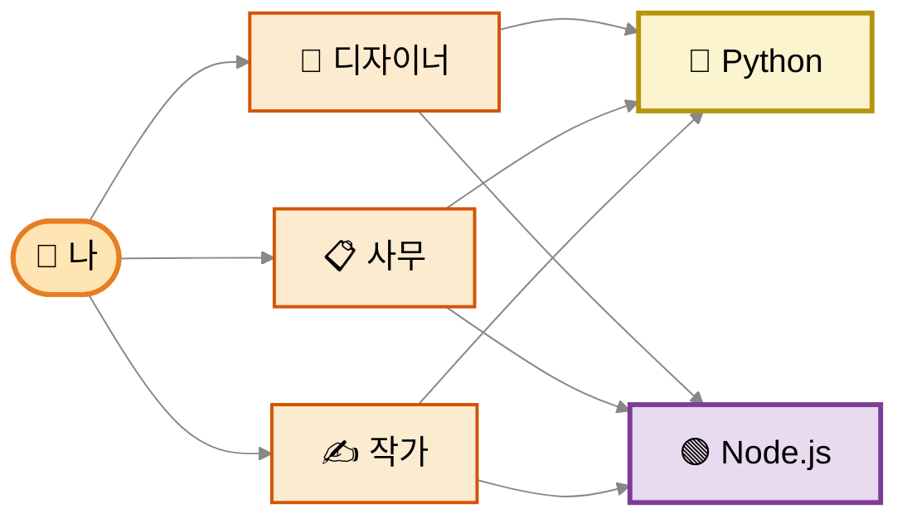
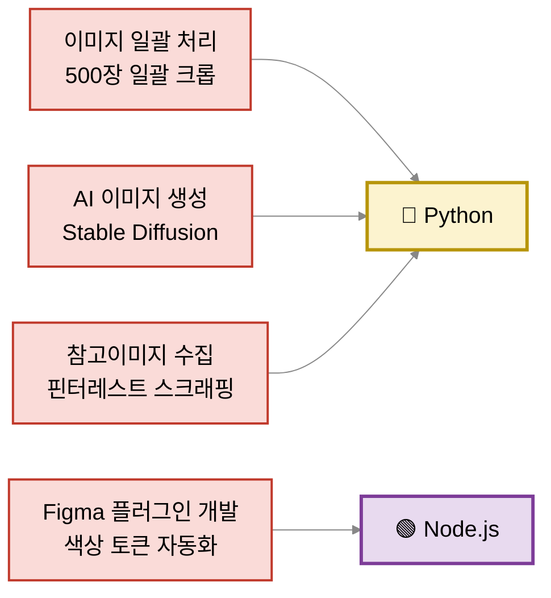
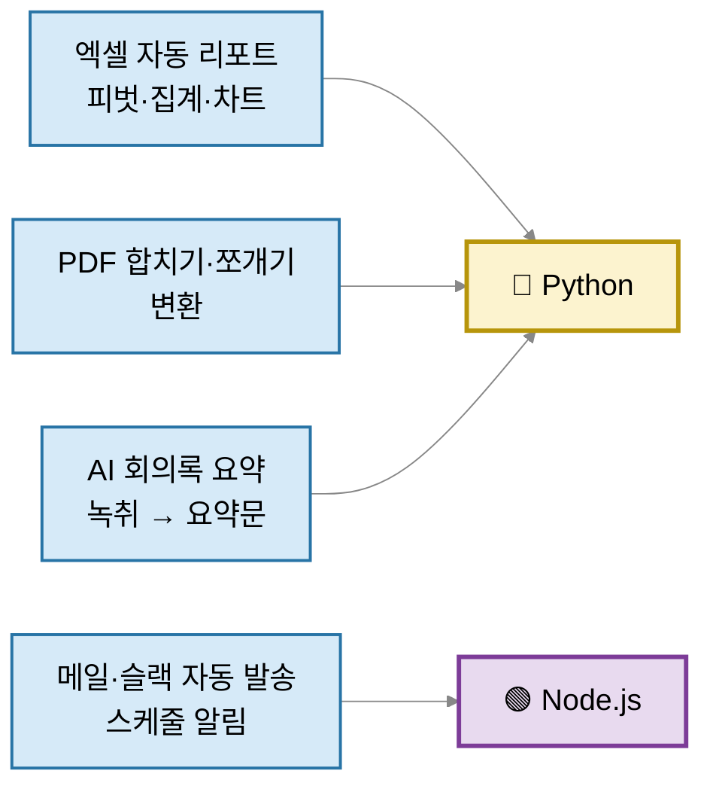
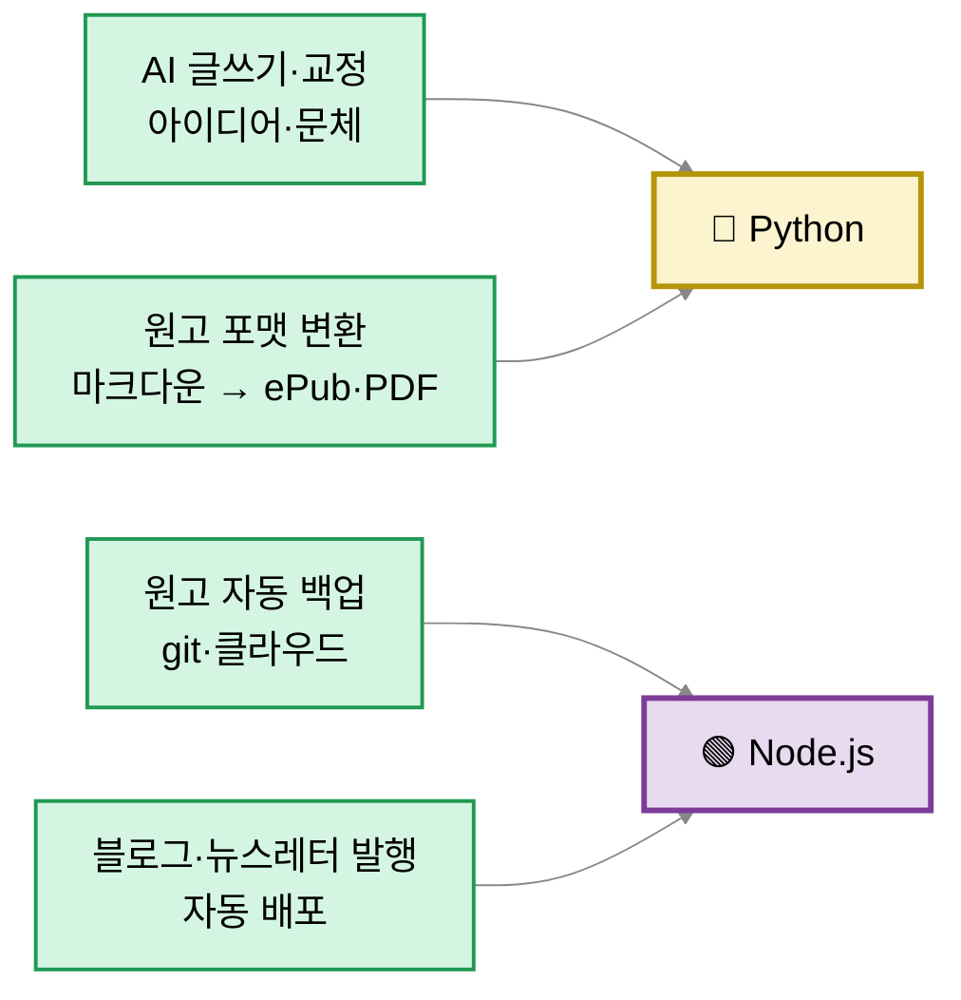
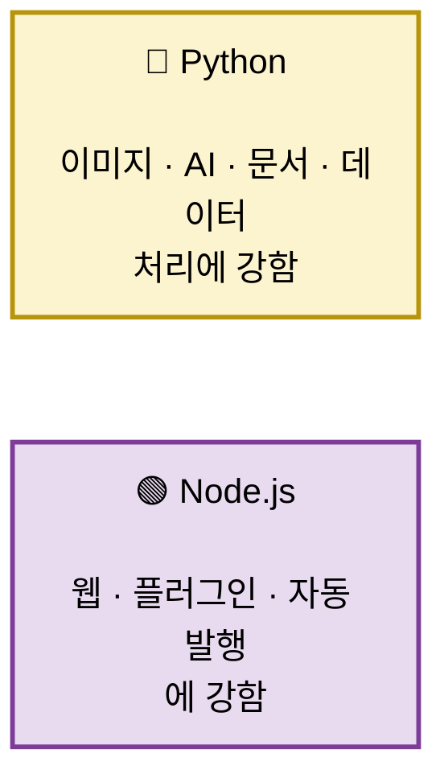

# 왜 Node.js랑 Python이 내 업무 자동화에 필요한가?

> 내 세 가지 역할(🎨 디자이너 · 📋 사무 · ✍️ 작가)에서 자동화하고 싶은 일들이 — 거의 다 이 두 엔진 위에서 돌아가기 때문.

---

## 1. 큰 그림

세 역할 → 모두 Python과 Node.js 둘 다 씀.

---

## 2. 🎨 디자이너 — 이런 자동화

---

## 3. 📋 사무 — 이런 자동화

---

## 4. ✍️ 작가 — 이런 자동화

---

## 5. 두 엔진의 역할 정리

---

## 한 줄 결론

- 🐍 Python = **사무·작가 작업의 대부분 + 디자인 일괄처리·AI 이미지**
- 🟢 Node.js = **피그마 플러그인·뉴스레터·메일봇·블로그 발행**
- 둘 다 미리 깔려있으니 → **"이거 쓰려면 Python/Node 필요"** 라고 적힌 도구를 그냥 바로 쓸 수 있음
