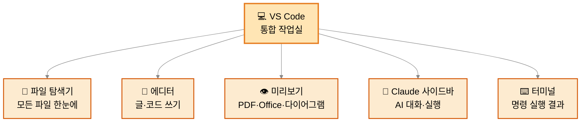
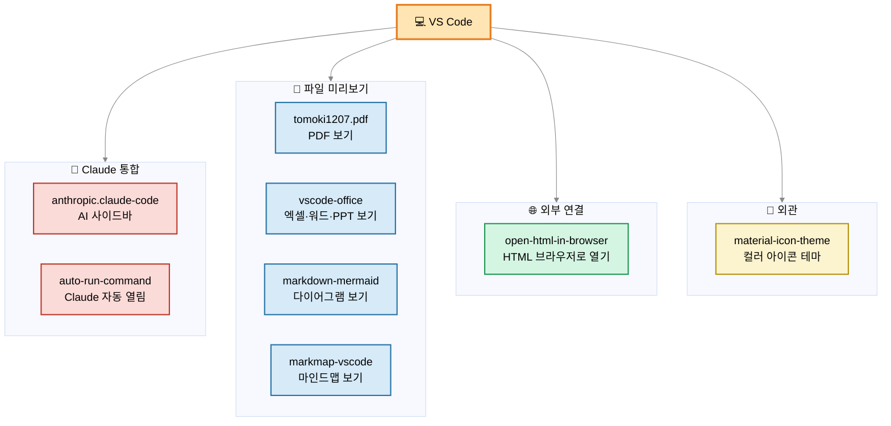
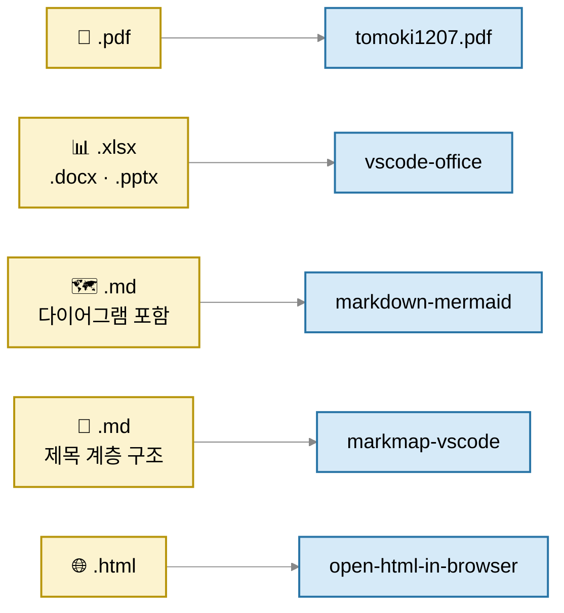
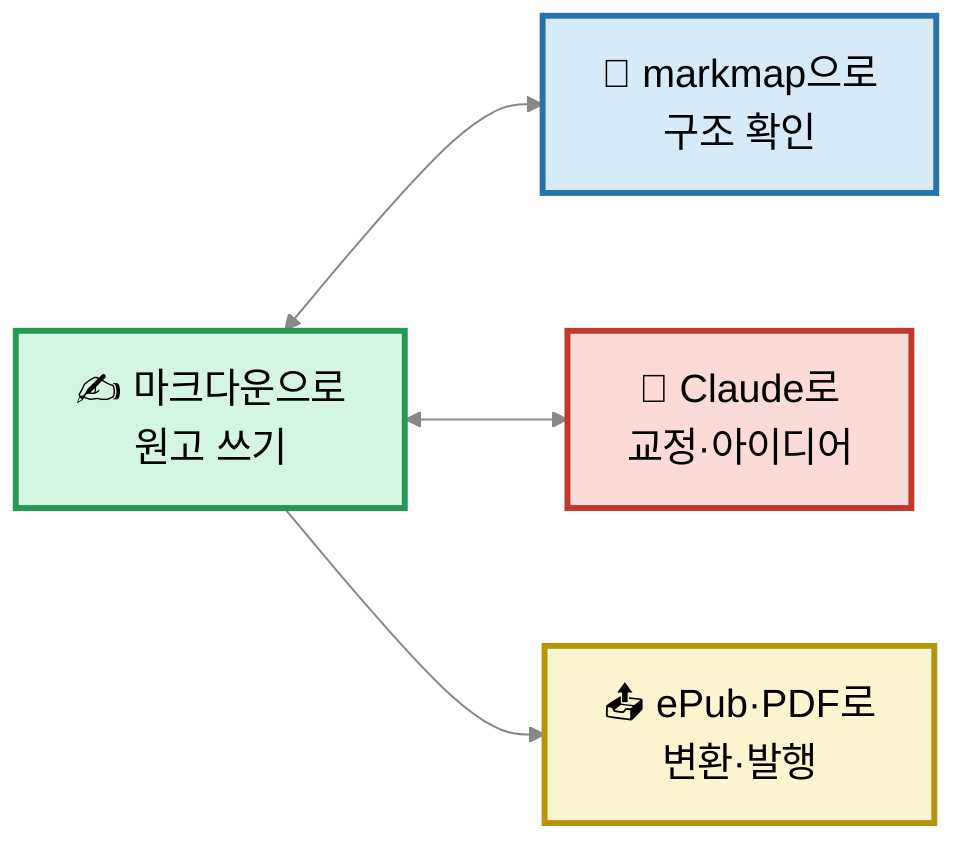
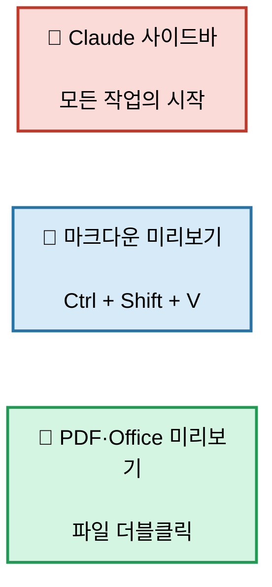

# 왜 VS Code랑 8개 확장이 필요해?

> 모든 작업이 한 창에서 끝나는 **통합 작업실**.
> Claude·파일·미리보기·터미널이 한 곳에 있어서 — 앱 5개 띄울 거를 한 창에서 끝냄.

---

## 1. VS Code = 한 창에 다 모인 본부

📌 **포인트:** Finder + 메모장 + 미리보기 + Claude 대화창 + 터미널 → 하나의 창.

---

## 2. 확장 8개 — 카테고리별

📌 **포인트:** 4개 카테고리 — AI / 미리보기 / 외부연결 / 외관.

---

## 3. 어떤 파일 → 어떤 확장이 봐줘?

📌 **포인트:** 파일 더블클릭만 해도 → 해당 확장이 자동으로 미리보기 띄움.

---

## 4. 내 세 역할에서 VS Code가 하는 일

```mermaid
%%{init: {'theme':'base', 'themeVariables': {'fontSize':'18px', 'lineColor':'#888', 'primaryTextColor':'#000'}, 'flowchart': {'nodeSpacing': 40, 'rankSpacing': 60}}}%%
flowchart TB
    subgraph Designer[" 🎨 디자이너 "]
        direction TB
        D1[웹 시안 HTML<br/>→ 브라우저로 바로 확인]:::d
        D2[참고이미지 폴더 탐색<br/>→ 컬러 아이콘으로 분류 쉬움]:::d
        D3[프로젝트 구조도<br/>→ 머메이드로 시각화]:::d
    end

    subgraph Office[" 📋 사무 "]
        direction TB
        O1[받은 PDF·엑셀<br/>→ 그 자리에서 미리보기]:::o
        O2[업무 플로우<br/>→ 다이어그램으로 정리]:::o
        O3[Claude에게 일 시키기<br/>→ 옆에서 결과 확인]:::o
    end

    subgraph Writer[" ✍️ 작가 "]
        direction TB
        W1[마크다운으로 원고 쓰기<br/>→ 깔끔한 에디터]:::w
        W2[글 구조 점검<br/>→ markmap으로 마인드맵]:::w
        W3[교정·발행 자동화<br/>→ Claude + 터미널]:::w
    end

    classDef d fill:#FADBD8,stroke:#C0392B,stroke-width:2px,color:#000
    classDef o fill:#D6EAF8,stroke:#2874A6,stroke-width:2px,color:#000
    classDef w fill:#D5F5E3,stroke:#229954,stroke-width:2px,color:#000
```

📌 **포인트:** 같은 VS Code 한 창에서 세 역할의 작업이 다 가능.

---

## 5. ✍️ 작가용 활용 흐름 (대표 워크플로우)

📌 **포인트:** 쓰기 → 구조 점검 → AI 교정 → 발행. **한 창에서 한 사이클.**

---

## 6. 가장 자주 만질 3가지

---

## 한 줄 정리

- **VS Code** = Claude·파일·미리보기·터미널이 모인 한 창짜리 작업실
- **확장 8개** = 디자인·사무·작가 작업에 맞게 튜닝한 플러그인 세트
- **가장 큰 효과** = 다른 앱 열지 않고 **한 창에서 한 사이클**이 끝남
