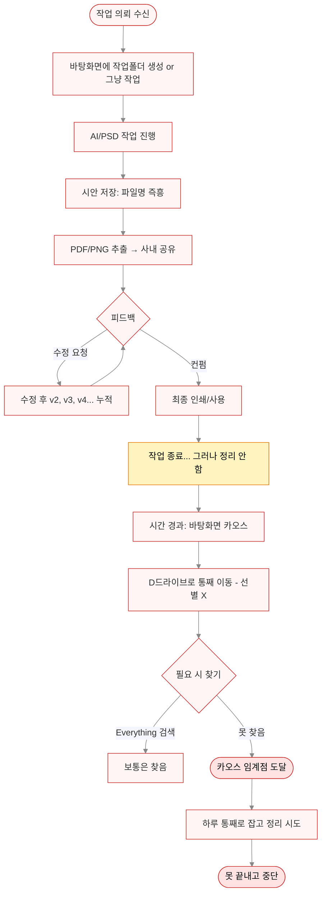
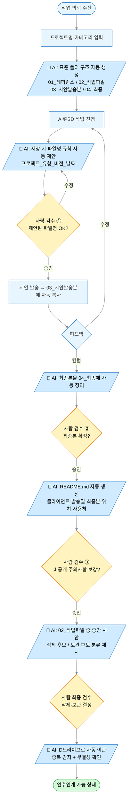

# 자동화 설계서: 디자인 파일 정리 & 인수인계 가능한 아카이브 구축

> Week1 Quest 2 — 업무 자동화 진단 및 프로세스 설계서
> 작성일: 2026-05-14
> 작성자: 회사 유일한 디자이너 (디자이너 + 회사원 + 작가 3개 역할)

---

## 1. 업무 명칭 및 정의

### 업무 명칭
**디자인 작업 파일 정리 및 아카이빙** (Design File Cleanup & Archiving)

### 업무 정의
회사 유일한 인하우스 디자이너로서 매주 누적되는 디자인 작업 파일(AI, PSD, PDF, PNG, JPG)을 정리하고, **언제든 인수인계 가능한 상태**로 아카이브하는 업무.

### 왜 이 업무인가 (자동화 1순위 선정 이유)

| 관점 | 내용 |
|------|------|
| 빈도 | 매일 파일은 누적되지만 정리 트리거는 "카오스 임계점" → 만성 미루기 |
| 영향도 | 회사 내 유일한 디자이너 = **단일 장애점(SPOF)**. 본인 외에는 어떤 파일이 최종본인지 알 수 없음 |
| 진짜 목표 | "**언제든 퇴사 가능한 정리된 상태**" — 단순 정리가 아닌 *인수인계 가능 수준의 자산화* |
| 현재 부분 자동화 | Everything 프로그램으로 파일명 검색 + Adobe Cloud 자동 동기화는 이미 사용 중 |

---

## 2. Before & After 비교

### Before (현재 상태)

| 항목 | 현황 |
|------|------|
| 총 소요 시간 | **하루 통으로 잡아도 못 끝냄** (= 사실상 ∞ / 영구 미완) |
| 전체 단계 수 | 12단계 (그 중 핵심인 "선별·메타데이터화" 단계가 통째로 누락) |
| 저장 위치 | 회사 데스크탑 바탕화면 + D드라이브 + Adobe Cloud (3중 분산) |
| 파일명 규칙 | 없음. 프로젝트명만 들어가고 `라벨.ai`, `라벨_2.ai`, `라벨_최종.ai` 식 즉흥 |
| 폴더 구조 | 프로젝트당 폴더 1개 (그 안은 카오스) |
| **주요 병목 3개** | ① 작업 중 파일명 즉흥성 → 시안/최종 구분 불가 ② 작업 종료 시 "선별·정리" 단계 자체가 없음 ③ D드라이브 이동이 백업인지 이사인지 모호 |
| 검색 방법 | Everything으로 파일명 검색 (본인만 가능, 후임자는 의미 모름) |
| 결과 | 본인 기억+검색으로는 찾음, 그러나 **후임자/협업자는 진입 불가** |

### After (AI 도입 후 예상)

| 항목 | 변화 |
|------|------|
| 총 소요 시간 | **최초 정리 1.5~2시간** + **이후 매 프로젝트 5분** (지속 유지) |
| 전체 단계 수 | 8단계 (AI 자동화 5 + 사람 검수 3) |
| 저장 위치 | D드라이브 단일 SSOT(Single Source of Truth) + Adobe Cloud는 작업 중 임시 |
| 파일명 규칙 | `[프로젝트]_[유형]_[버전]_[YYMMDD].확장자` 자동 제안 |
| 폴더 구조 | 표준 템플릿 4단: `01_레퍼런스 / 02_작업파일 / 03_시안발송본 / 04_최종` |
| 메타데이터 | 각 프로젝트 폴더에 `README.md` 자동 생성 (클라이언트·발송일·최종본 위치 명시) |
| 검색 방법 | Everything + 표준 파일명 + README로 **누구든** 진입 가능 |

### 체감 변화 (소멸하는 작업들)

- ❌ "이 파일 뭐였더라?" 하면서 일일이 열어보는 시간 → **소멸**
- ❌ `최종_최종_진짜최종_v2.ai` 식 즉흥 네이밍 → **소멸**
- ❌ D드라이브 통째로 이동 후 "백업한 거였나?" 망설임 → **소멸**
- ❌ 카오스 임계점까지 미루다가 통째 정리 → **소멸**
- ✅ 후임자가 폴더 열어 README 읽고 5분 안에 맥락 파악 → **신규 가치**

---

## 3. 업무 흐름도

### Before 흐름도 (현재)

### After 흐름도 (AI 도입 후)

**범례:**
- 🟦 파란 박스 = AI가 자동 수행
- 🟨 노란 다이아몬드 = 사람 검수 지점 (Human-in-the-loop)
- 🟩 초록 박스 = 최종 산출 상태

---

## 4. AI 협업 포인트

### AI가 대신할 수 있는 부분 (자동화 영역)

| # | 단계 | AI 역할 | 구체적 작업 |
|---|------|--------|------------|
| ① | **프로젝트 시작** | 폴더 템플릿 생성기 | 프로젝트명 입력 시 표준 4단 폴더 자동 생성 (`01_레퍼런스/02_작업파일/03_시안발송본/04_최종`) |
| ② | **파일 저장 시점** | 파일명 규칙 제안기 | `[프로젝트]_[유형]_[버전]_[YYMMDD].확장자` 패턴 자동 제안. 디자이너가 단축키로 승인 |
| ③ | **시안 발송 시점** | 파일 자동 분류기 | 발송한 PDF/PNG를 `03_시안발송본` 폴더로 자동 복사 + 발송일 메타데이터 기록 |
| ④ | **컨펌 완료 시점** | 최종본 식별기 | 컨펌받은 시안을 `04_최종` 폴더로 자동 이동 + 버전 충돌 시 알림 |
| ⑤ | **메타데이터 생성** | README 자동 작성기 | 프로젝트 README.md 자동 생성 (클라이언트, 발송일, 최종본 경로, 사용처, 주요 의사결정) |
| ⑥ | **종료 시점 분류** | 시안 분류 어시스턴트 | `02_작업파일` 스캔 → "최종에 사용됨 / 중간 시안 / 백업 후보 / 삭제 후보" 분류 제시 |
| ⑦ | **백업·이관** | 중복 감지·무결성 검사기 | 바탕화면 → D드라이브 이관 시 중복 파일 자동 감지, 해시 검증으로 누락 방지 |

### 사람이 반드시 검수해야 할 부분 (Human-in-the-loop)

| 검수 지점 | 왜 사람이 해야 하는가 |
|----------|---------------------|
| **① 파일명 규칙 승인** | AI가 제안한 명명이 클라이언트·내부 컨벤션과 맞는지는 디자이너 판단 영역 |
| **② 최종본 확정** | "어떤 시안이 실제 채택되었는가"는 회의·구두 컨펌의 맥락을 아는 사람만 정확히 안다 |
| **③ README 비공개 항목 보강** | 클라이언트명/계약 조건 등 외부 공개 불가 항목은 디자이너가 직접 마스킹 |
| **④ 삭제 vs 보관 최종 결정** | 추후 재활용 가능성, 법적 보관 의무, 감정적 애착(!) 등은 AI가 판단 불가 — **가장 중요한 검수 지점** |

### AI 협업 시 사용할 도구·환경 (제안)

- **Claude (대화형 AI)**: 폴더 구조 설계, README 템플릿 생성, 분류 기준 토론
- **PowerShell 스크립트 + AI 생성**: 파일명 일괄 변경, 중복 감지, 폴더 자동 생성
- **Adobe Bridge / Eagle 등 자산 관리 툴**: 썸네일 기반 시각 분류 (AI 분류 결과 검수용)
- **기존 자산 유지**: Everything (빠른 검색), Adobe Cloud (작업 중 동기화)

---

## 5. 기대 효과

### 정량적 효과

- 정리 1회당 소요 시간: **8시간+ (못 끝냄) → 1.5~2시간 (완료 가능)**
- 새 프로젝트당 정리 부담: **사후 일괄 → 진행 중 5분 단위 분산**
- 파일 검색 실패율: **간헐 실패 → 0에 수렴** (표준 명명 + README)

### 정성적 효과

- 🎯 **"언제든 퇴사 가능한 상태"** 라는 본래 목표 달성
- 🎯 단일 장애점(SPOF) 해소 — 후임자/협업자 진입 가능
- 🎯 카오스 임계점까지 미루던 정신적 부담 소멸
- 🎯 본인의 발산형 작업 스타일은 유지하면서, 정리는 AI가 백업

### 부수 효과

- 표준 폴더 구조 + README는 **포트폴리오 작성에도 즉시 활용 가능**
- 향후 외주·신규 디자이너 합류 시 온보딩 시간 단축
- 회사 자산으로서의 디자인 IP 추적 가능

---

## 6. 다음 단계 (실행 계획)

1. **이번 주**: 표준 폴더 템플릿 + 파일명 규칙 1차 안 확정
2. **다음 주**: PowerShell 스크립트 작성 (폴더 생성기, 일괄 리네임)
3. **2주 차**: 현재 진행 중인 프로젝트 1개에 시범 적용
4. **3주 차**: D드라이브 기존 자산 일괄 마이그레이션 (1.5~2시간 집중 작업)
5. **4주 차**: README 템플릿 정착, 회고 후 규칙 보완

---

*이 문서는 Claude(Anthropic)와 대화하며 작성되었습니다. 자세한 대화 과정은 동봉된 스크린샷을 참고하세요.*
